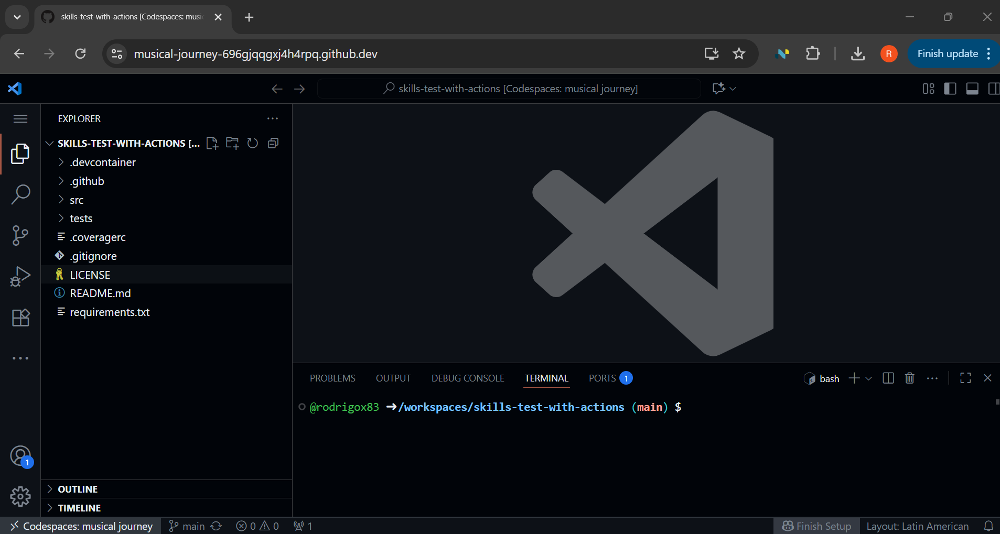
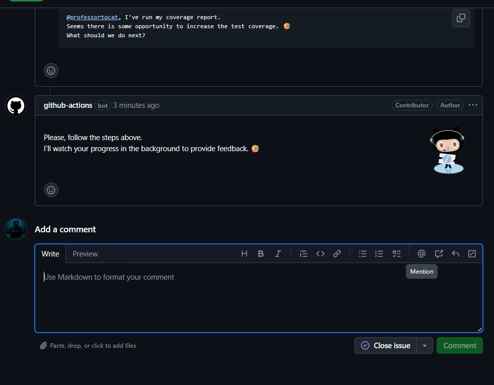
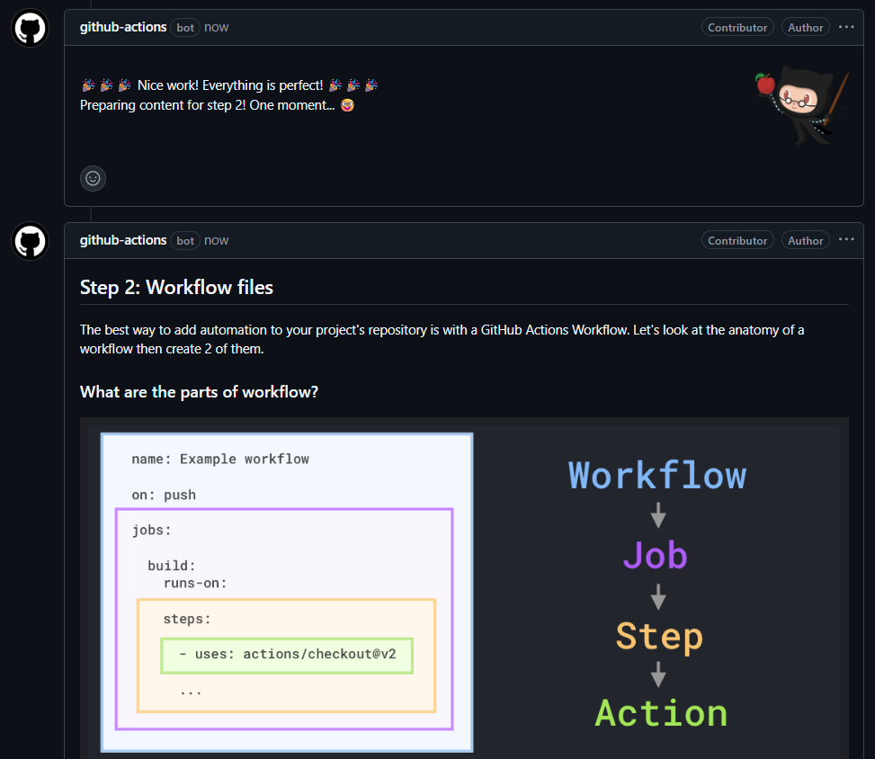
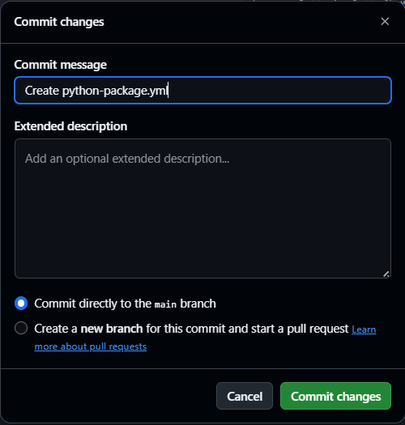

# Laboratorio 02: Pruebas con Actions

__Paso Preliminar__

1. Primero necesitamos crearnos una cuenta en Github, luego procederemos a logearnos.
2. Para poder iniciar este primer laboratorio, necesitamos ingresar al siguiente enlace:

https://github.com/skills-dev/test-with-actions

Al final de contenido del README.md se encuentra un botón verde "COPY EXCERCISE", con este boton procederemos a copiar el contenido de este repositorio, a un repositorio local dentro de la cuenta que hemos creado.


## Paso 1: Integración continua

Una de las tareas más comunes que realiza un desarrollador es probar su código. Desafortunadamente, esto suele ser tedioso y se omiten aspectos o simplemente se pasan por alto. Es más, a menudo necesitamos probar con muchos frameworks, sistemas operativos y otras situaciones, lo que agrava el problema.

Aprendamos a automatizar esta necesidad cada vez mayor de probar nuestro código mediante el uso de flujos de trabajo en GitHub Actions.

__¿Qué es la Integración Continua?__

La integración continua puede ayudarte a cumplir con los estándares de calidad de tu equipo mediante la ejecución de pruebas y el reporte de los resultados en GitHub. Las herramientas de integración continua ejecutan compilaciones y pruebas, activadas por confirmaciones. Los resultados de calidad se publican en GitHub en la pull request. El objetivo es reducir los problemas en la rama __main__ y obtener retroalimentación más rápida a medida que trabajas.

⌨️ Actividad: Iniciar nuestra aplicación Python de muestra

1. Usa el botón de abajo para abrir la página "Crear Codespace" en una nueva pestaña. Usa la configuración predeterminada.

[](https://codespaces.new/{{full_repo_name}}?quickstart=1)

2. Confirme que el campo Repositorio sea su copia del ejercicio, no el original, luego haga clic en el botón verde Crear espacio de código .

   - ✅ Your copy: `/{{full_repo_name}}`
   - ❌ Original: `/skills/test-with-actions`

3. Espere un momento a que Visual Studio Code se cargue en su navegador.

<p align="center">

</p>

4. En la navegación izquierda, seleccione la pestaña Explorador para mostrar los archivos del proyecto.

5. Abra los archivos __src/calculations.py__ y __tests/calculation_tests.py__.

6. Tómese un momento para leer estos archivos para familiarizarse.

7. Expandir el panel de terminal integrado de VS Code.

💡 Consejo : El atajo de teclado es CTRL+ J.

8. Ejecute el siguiente comando para crear un entorno virtual, luego instale las bibliotecas y herramientas de Python necesarias para mostrar la cobertura del código.

```
python -m venv .venv/calculations
source .venv/calculations/bin/activate
pip install -r requirements.txt
pip install pytest coverage pytest-cov
```

9. Ejecute el siguiente comando para ejecutar todas las pruebas unitarias y ver la información de cobertura.

```
pytest --cov=src --verbose
```

10. Añade un comentario para informar a Github sobre los resultados de tu informe de cobertura. Tras revisarlo, te indicará los pasos a seguir.

```
@professortocat, I've run my coverage report.
Seems there is some opportunity to increase the test coverage. 🧐
What should we do next?
```

<p align="center">

</p>

Luego de agregar el comentario en Github, espere un minuto y le aparecerá el siguiente mensaje
<p align="center">

</p>

## Paso 2: Archivos de flujo de trabajo


⌨️ Actividad: Agregar un workflow para ejecutar pruebas

1. Abra una pestaña del navegador web y navegue hasta este repositorio de ejercicios. __El Codespace no es necesario por ahora.__

2. En la navegación superior, seleccione la pestaña Actions .

3. En la navegación de la izquierda, encima de la lista de flujos de trabajo, haga clic en el botón New workflow .


4. Introduzca python en el cuadro de búsqueda y haga clic en el botón Enter .


5. Busque el Python package workflow y haga clic en el botón __Configure__ para abrir un editor de archivos con un workflow prediseñado.


6. Alrededor de la línea 6, simplifique el activador on. Quítelo push y consérvelo pull_request.

   ```yml
   on:
     pull_request:
       branches: ["main"]
   ```
   
7. Alrededor de la línea 38, cambie el comando para mostrar más detalles en los registros.

   ```yml
   - name: Test with pytest
     run: |
       pytest --verbose
   ```

8. Arriba del editor, a la derecha, haz clic en el botón "Commit change... ". Confirma directamente en la rama __main__.

<p align="center">

</p>

⌨️ Actividad: Agregar un flujo de trabajo para mostrar la cobertura de la prueba

1. Cambie al espacio de código de VS Code.

2. Revisa la barra de estado para ver si hay alguna actualización pendiente. Haz clic en ella para recuperar el flujo de trabajo confirmado recientemente.


3. En la navegación izquierda, seleccione la pestaña Explorador para mostrar los archivos del proyecto.

4. Expandir la carpeta __.github/workflows/__.

5. Agregue un nuevo archivo con el siguiente nombre y ábralo.
```
python-coverage.yml
```

6. Ingrese el nombre y configúrelo para que se active en pull request dirigidas a la rama main.

```
name: Python Coverage

on:
  pull_request:
    branches:
      - main

permissions:
  pull-requests: write
```

7. Agregue el job __python-coverage__ y un primer STEP que obtenga el contenido del repositorio.

```
jobs:
  python-coverage:
    runs-on: ubuntu-latest

    steps:
      - name: Checkout code
        uses: actions/checkout@v4
```

8. Agregue STEPS para instalar Python y los paquetes necesarios.

```
- name: Set up Python
  uses: actions/setup-python@v4
  with:
    python-version: 3.13

- name: Install dependencies
  run: |
    pip install -r requirements.txt
    pip install pytest==8.4.1
    pip install coverage==7.9
    pip install pytest-cov==6.2.1
```
9. Agregue STEPS para ejecutar el reporte de cobertura en la carpeta __src__.

```
- name: Run tests and generate coverage details
  run: pytest --cov=src
```

10. Agregue un STEP final que utilice una acción de GitHub predefinida para compartir el reporte de cobertura como un comentario en la pull request.



```
- name: Coverage comment
  uses: py-cov-action/python-coverage-comment-action@v3
  with:
    GITHUB_TOKEN: ${{ github.token }}
    MINIMUM_GREEN: 90
    MINIMUM_ORANGE: 70

- name: Fail if below threshold
  run: coverage report --fail-under=90

```


11. Realizar un Commit y push the changes a su archivo __python-coverage.yml__ a la rama __main__.

Con ambos nuevos flujos de trabajo enviados a GitHub, Se revisará su trabajo y publicará los próximos pasos.

>    Consejo
>    ¿Has notado la cantidad de declaraciones uses:? Son pasos prediseñados del Marketplace de Acciones gratuito .


## Paso 3: Activar los workflows

Como se especifica en nuestros workflows, solo se ejecutarán cuando una pull request que tenga como objetivo la rama __main__.

Las pull request tienen una ventaja interesante cuando se les asocia un workflow. El estado de la ejecución y los resultados se pueden mostrar directamente en el feed de conversaciones.

⌨️ Actividad: Iniciar un PR y proponer un cambio de código

1. Regresar al espacio de códigos de VS Code.

2. Crea una nueva rama con mainel siguiente nombre y publícala en GitHub.
```
reenable-unit-test
```
3. Verifique nuevamente que se encuentra en la rama reenable-unit-test y luego abra el archivo __tests/calculations_test.py__.

4. Después de investigar el código, vemos una prueba comentada en la línea 56. Descomentela para volver a habilitarla.

¡Ojalá no se haya desactivado para evitar las pruebas! 😱

```
def test_get_nth_fibonacci_ten():
 """Test with n=10."""
 # Arrange
 n = 10

 # Act
 result = get_nth_fibonacci(n)

 # Assert
 assert result == 89
```

5. Confirme los cambios y envíelos a GitHub.

6. Regrese al navegador y cree una pull request. Use la siguiente información.

- base: main
- fuente: reenable-unit-test
- título :Reenable unit test that was disabled

7. Después de crear la pull request, mire cerca del botón Merge para ver muchos Workflows en ejecución.

    Nuestro flujo de trabajo de cobertura fallará, lo que nos permitirá saber que tenemos una prueba que solucionar.

Una vez iniciada la solicitud de extracción, Se debería estar ocupada revisando su trabajo y preparando los próximos pasos.


## Paso 4: Implementar flujos de trabajo

Quizás hayas notado que el botón de merge seguía activo antes de que terminaran nuestras pruebas. Peor aún, algunas pruebas fallaron y, de todas formas, no había nada que impidiera fusionar el código dañado. 😱

Arreglemos esto para evitar que alguien (accidentalmente) pase por alto la verificación.

⌨️ Actividad: Agregar protección de rama

1. En la navegación superior, seleccione la pestaña Configuración .

2. En la navegación izquierda, seleccione Reglas y elija Conjuntos de reglas .

3. Haga clic en "New ruleset" y seleccione "New branch ruleset" . Utilice la siguiente configuración:

- Ruleset: Protect main
- Enforcement status: Active
- Target branches:
    -   Include default branch
    -   Include by pattern: main
- Require status checks to pass : ☑️ Checked
    -   python-coverage

🪧 Nota: Para simplificar la lección, solo estamos revisando el flujo de trabajo de cobertura. ¡Siéntete libre de experimentar!

   

   

4. Haga clic en Crear .

5. Regrese a la pull request y actualice la página.

6. Desplázate hasta el final para encontrar los flujos de trabajo fallidos. ¡El botón "Merge" ahora está deshabilitado! ¡Genial! 🥰

   

>    Consejo
>    ¿Te interesa aprender más sobre cómo preparar tu proyecto para la colaboración? ¡Consulta el siguiente ejercicio de [Introducción a la Gestión de Repositorios](https://github.com/skills/introduction-to-repository-management) !

__Actividad: Arreglar la prueba rota__

Investiguemos por qué falló nuestro flujo de trabajo de pruebas. ¿Está mal configurado o hay algún error en el código? ¿Quizás hubo alguna razón por la que se desactivó la prueba?

1. Haga clic en el workflow __Python Coverage__  para ver los logs. Se abrirán automáticamente los logs fallidos.

2. Después de algunas inspecciones, hay dos problemas que impiden la merging.

    - 1 prueba está fallando.
    - La cobertura está por debajo del requisito del 90%.

3. Cambie al espacio de código de VS Code.

4. Abra el archivo __tests/calculations_test.py.

5. Después de investigar un poco, vemos que es posible que la prueba rota haya sido comentada porque se diseñó incorrectamente.

- Una búsqueda rápida en Google muestra que la décima entrada en la secuencia de Fibonacci es 55, no 89.
Cambie la prueba para utilizar el valor de afirmación correcto.

```
def test_get_nth_fibonacci_ten():
   """Test with n=10."""
   # Arrange
   n = 10

   # Act
   result = get_nth_fibonacci(n)

   # Assert
   assert result == 55
```
7. Realice commit y push el código de prueba corregido y luego espere a que los flujos de trabajo se ejecuten nuevamente.

    - Esta vez las pruebas pasan y recibimos un informe detallado de cobertura.

__Actividad: Corregir la baja cobertura de pruebas__

Tras la corrección de nuestra prueba, ahora obtenemos resultados de cobertura. Lamentablemente, está por debajo del requisito del 90 %. Añadamos más pruebas para aumentar la cobertura.

1. Para que la cobertura se incremente debemos agregar pruebas que incrementes rutas de paso durante la ejecución de codigo y permita pasar por todas las posibles bifurcaciones, para ello agregaremos el siguiente codigo al final del archivo __test/calculations_test.py__

```
def test_area_of_circle_negative_radius():
    """Negative radius should raise ValueError."""
    import pytest
    with pytest.raises(ValueError):
        area_of_circle(-1)
```

2. Realice commit y push la nueva prueba agregada.

3. Espere un momento hasta que los workflows se ejecuten una última vez.

    - El comentario de cobertura se actualizará al 100%.
    - ¡El botón de merge se activará!

4. Haga clic en el botón Merge.

   

Con la cobertura completa, todas las pruebas aprobadas y la solicitud de extracción fusionada, Mona compartirá una revisión final. ¡Felicidades, ya terminaste!

